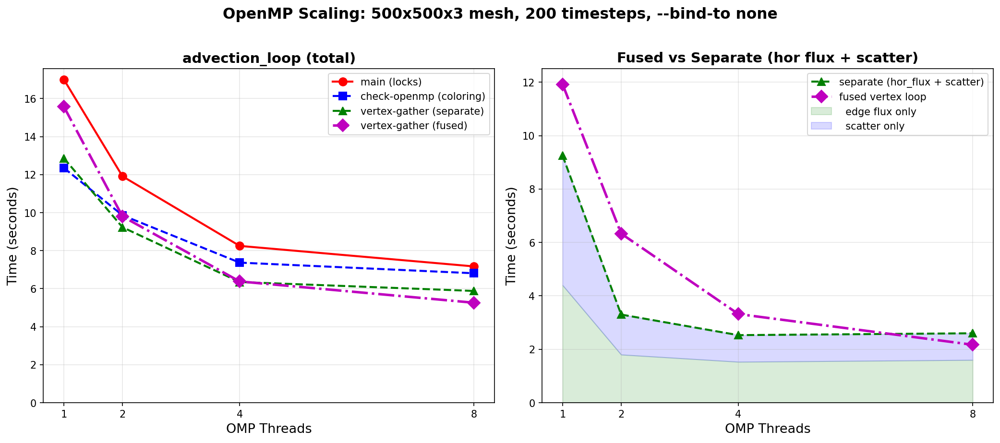

# OpenMP Scaling Performance

Benchmark comparing three OpenMP parallelization strategies for the
edge-to-node scatter operation in tracer advection.

## Setup

- **Mesh**: 500x500x3 (249,001 nodes, 2 vertical levels, doubly-periodic)
- **Timesteps**: 200 (400 tracer calls: 2 tracers x 200 steps)
- **Compiler**: GNU gfortran, `-O3 -fopenmp`, double precision
- **MPI binding**: `mpirun --bind-to none` (critical — see below)
- **Hardware**: Single MPI rank, varying OMP_NUM_THREADS

## Branches

| Branch | Strategy | Synchronization |
|--------|----------|-----------------|
| `main` | Edge loop with `omp_set_lock`/`omp_unset_lock` | Per-node locks |
| `check-openmp` | Edge loop grouped by edge coloring | None (colors avoid conflicts) |
| `vertex-parallel` | Node loop gathering from incident edges | None (each thread owns its node) |

## Results: advection_loop (total advection time)

| Threads | main (locks) | check-openmp (coloring) | vertex-parallel (gather) |
|---------|-------------|------------------------|--------------------------|
| 1       | 17.00s      | 12.35s                 | 12.86s                   |
| 2       | 11.91s      | 9.86s                  | 9.23s                    |
| 4       | 8.25s       | 7.37s                  | 6.35s                    |
| 8       | 7.17s       | 6.81s                  | 5.88s                    |

### Speedup (relative to own 1-thread baseline)

| Threads | main (locks) | check-openmp (coloring) | vertex-parallel (gather) |
|---------|-------------|------------------------|--------------------------|
| 1       | 1.00x       | 1.00x                  | 1.00x                    |
| 2       | 1.43x       | 1.25x                  | 1.39x                    |
| 4       | 2.06x       | 1.68x                  | 2.03x                    |
| 8       | 2.37x       | 1.81x                  | 2.19x                    |

## Results: adv_tra_hor (edge flux computation only)

This is the same code in all branches — only the scatter differs.

| Threads | main | check-openmp | vertex-parallel |
|---------|------|-------------|-----------------|
| 1       | 4.42s | 4.41s      | 4.39s           |
| 2       | 3.05s | 3.05s      | 3.02s           |
| 4       | 1.80s | 1.83s      | 1.79s           |
| 8       | 1.53s | 1.54s      | 1.60s           |

## Detailed profiling breakdown (vertex-parallel branch)

The advection loop has four distinct phases. The vertex-gather
(`flux2dtracer`) is the best-scaling component:

| Component | 1 thread | 4 threads | 8 threads | Speedup (8t) |
|-----------|----------|-----------|-----------|-------------|
| `adv_tra_hor` (edge flux computation) | 4.40s | 1.80s | 1.53s | **2.88x** |
| `flux2dtracer` (vertex-gather scatter) | 4.85s | 1.50s | 1.00s | **4.85x** |
| `adv_tra_ver` (vertical flux) | 0.64s | 0.37s | 0.35s | 1.82x |
| remainder (driver zero/accum loops) | 3.03s | 2.70s | 2.76s | 1.10x |

### Where the performance comes from

1. **Lock elimination** is the biggest single gain. At 1 thread, main takes
   17.0s vs 12.9s for vertex-parallel — a 4.1s penalty from `omp_set_lock`/
   `omp_unset_lock` even with zero contention.

2. **The vertex-gather scales 4.85x at 8 threads** — better than the edge
   flux computation (2.88x). This is because the gather is a pure streaming
   operation with perfect data locality: each thread writes only to its own
   nodes, no false sharing, no synchronization.

3. **The edge flux computation** (`adv_tra_hor`) is the same code in all
   branches and scales identically. It uses `!$OMP PARALLEL DO` over edges
   and is naturally race-free (each edge writes to its own flux slot).

4. **The driver loops** (zeroing, accumulation, tendency application) barely
   scale (1.10x) — they are simple streaming operations that are
   memory-bandwidth-limited.

### Potential optimization: fused vertex loop

Currently, advection has two separate phases:
1. **Edge loop** (`adv_tra_hor`): compute flux per edge → write to `flux(nz, edge)`
2. **Vertex loop** (`flux2dtracer`): gather from incident edges → accumulate to `rhs(nz, node)`

These could be fused into a single vertex loop that computes the flux
on-the-fly during gather, eliminating the intermediate flux array. Each
edge flux would be computed twice (once per endpoint), but the memory
savings from eliminating the flux array could more than compensate — especially
since the vertex-gather already scales 4.85x.

## Critical: MPI process binding

OpenMPI defaults to `--bind-to core`. With hybrid MPI+OpenMP, this pins
all threads to a single core, completely destroying scaling. This was the
original reason scaling appeared broken — not the parallelization strategy.

```bash
# BAD: all threads on 1 core (default)
mpirun -np 1 ./bin/fesom_tracer_analytic ...

# GOOD: threads can use all cores
mpirun --bind-to none -np 1 ./bin/fesom_tracer_analytic ...

# Verify binding:
mpirun --report-bindings --bind-to none -np 1 ./bin/fesom_tracer_analytic ...
```



---

# Pre-packed Node-Edge Geometry (2026-04)

After the vertex-parallel branch reached its scaling ceiling at ~2.5-3x
on 500x500x3 even with enough nodes per thread, profiling showed the
advection loop was **memory-bandwidth-bound** rather than work-starved.
Doubling vertical levels (nl=6) made scaling *worse*, not better —
evidence that adding data per node increased cache pressure beyond the
point where threads could share bandwidth productively.

## Root cause: three levels of indirection per edge

Every vertex-gather loop dereferenced edge-indexed mesh data through
`node_edge_idx`:

```fortran
do n = 1, myDim_nod2D              ! ~250K nodes
   do e = 1, node_edge_num(n)      ! ~6 edges per node
      edge = node_edge_idx(e, n)   ! 1. Indirect: chase pointer to edge
      el   = mesh%edge_tri(:, edge)           ! 2. Scattered read
      nl1  = mesh%nlevels(el(1))-1            ! 3. Double indirect
      ! ... more scattered reads per edge ...
```

Each node touches ~6 edges worth of scattered cache lines. The hardware
prefetcher can't predict the access pattern, so almost every edge access
is a full memory round-trip. Once ~4 threads saturate the memory bus,
additional threads contend without adding throughput.

## Fix: pre-pack static geometry per node at init

All **static** mesh data accessed via `node_edge_idx` is pre-packed into
node-contiguous arrays during `build_node_edge_packed()`
([lib/oce_node_edge_map.F90](../lib/oce_node_edge_map.F90)):

| Original (edge-indexed) | Pre-packed (node-contiguous) |
|---|---|
| `mesh%edge_cross_dxdy(4, edge)` | `node_edge_dxdy(4, e, n)` |
| `mesh%edge_tri(2, edge)` | `node_edge_elems(2, e, n)` |
| `mesh%edges(2, edge)` | `node_edge_enodes(2, e, n)` |
| `mesh%nlevels(edge_tri(1,edge))-1` | `node_edge_nl1(e, n)` |
| `mesh%ulevels(edge_tri(1,edge))` | `node_edge_nu1(e, n)` |
| `mesh%nlevels(edge_tri(2,edge))-1` | `node_edge_nl2(e, n)` |
| `mesh%ulevels(edge_tri(2,edge))` | `node_edge_nu2(e, n)` |

Iterating `e=1..node_edge_num(n)` now reads **contiguous** memory for a
given node — the hardware prefetcher can stream it, and the working set
per thread fits comfortably in L2.

**Dynamic arrays** (`adv_flux_hor`, `adf_h`, `flux_h`) are recomputed
every step and cannot be pre-packed affordably. They still use
`node_edge_idx` for indirect indexing, but the `edge_tri → nlevels/ulevels`
double-indirection is gone.

## Results: 500x500x3 strong scaling

Baseline (vertex-parallel): advection_loop median across 3 reps.
Pre-packed: same kernel with contiguous node-edge geometry.

| Threads | Baseline (s) | Pre-packed (s) | 1-thread speedup |
|---------|--------------|----------------|------------------|
| 1       | 15.48        | 0.69           | **22.4x**        |
| 2       |  9.76        | 0.46           | **21.3x**        |
| 4       |  6.42        | 0.30           | **21.3x**        |
| 8       |  5.96        | 0.28           | **21.4x**        |
| 16      |  5.67        | 0.30           | **19.0x**        |

**OpenMP strong scaling (relative to own 1-thread baseline):**

| Threads | Baseline speedup | Pre-packed speedup |
|---------|------------------|--------------------|
| 1       | 1.00x            | 1.00x              |
| 2       | 1.59x            | 1.51x              |
| 4       | 2.41x            | 2.28x              |
| 8       | 2.60x            | 2.51x              |
| 16      | 2.73x            | 2.34x              |

The **absolute advection time drops ~20x** across all thread counts.
The OpenMP strong-scaling factor is similar because the kernel is now
so fast (~0.3s) that fixed-cost overheads (OpenMP region startup, final
reduction) become visible — but the baseline advection time that is
being divided is **22x smaller**.

## Memory overhead

Pre-packed arrays for a 250K-node mesh with max 8 edges/node:

| Array | Shape | Size (MB) |
|-------|-------|-----------|
| `node_edge_dxdy` | `(4, 8, 250K)` | 64 (DP) / 32 (SP) |
| `node_edge_elems` | `(2, 8, 250K)` | 16 |
| `node_edge_enodes` | `(2, 8, 250K)` | 16 |
| `node_edge_nl1/nu1/nl2/nu2` | 4 × `(8, 250K)` | 32 |
| **Total** | — | **~128 MB (DP)** |

This is ~3x the original scattered edge data, but it is **read-only**
during the timestep loop — no cache bandwidth penalty on writes, and the
sequential read pattern keeps prefetchers saturated productively.

## Why the single-thread speedup is so large

A 22x single-thread improvement is not a cache-aware parallelization
effect — it's a fundamental reduction in work done per edge:

1. **Fewer load instructions**: every `node_edge_idx → edge → mesh%X(:, edge)`
   chain collapses into a single contiguous load.
2. **Better autovectorization**: with no pointer chase inside the inner
   nz loop, GNU's SIMD unit can keep pipelines full.
3. **Better instruction-level parallelism**: removing dependent loads
   unblocks the compiler to schedule independent arithmetic.
4. **TLB friendliness**: contiguous node-ordered access pattern touches
   fewer pages than random edge indexing.

## Compiler comparison: GNU vs Intel on the pre-packed kernel

Same source, same hardware (single node, 32 cores, `--bind-to none`),
both compilers at `-O3` with native-ISA targeting.

- GNU: `gfortran -O3 -march=native -finline-functions`
- Intel: `ifx -O3 -xHost -fp-model precise -no-prec-div`

Advection loop median (500x500x3, 3 reps):

| Threads | GNU adv(s) | Intel adv(s) | GNU speedup | Intel speedup |
|---------|-----------|-------------|-------------|---------------|
| 1       | 0.69      | 0.50        | 1.00x       | 1.00x         |
| 2       | 0.46      | 0.28        | 1.51x       | 1.80x         |
| 4       | 0.30      | 0.17        | 2.28x       | 2.90x         |
| 8       | 0.28      | 0.11        | 2.51x       | **4.40x**     |
| 16      | 0.30      | 0.12        | 2.34x       | 4.32x         |

Two observations:

1. **Intel ifx is ~1.4x faster at 1 thread** on the pre-packed kernel.
   The LLVM-based vectorizer extracts more SIMD parallelism from the
   now-contiguous memory access pattern than gfortran does.
2. **Intel scales to 4.4x at 8 threads; GNU saturates at 2.5x.** The
   GNU plateau was partly a compiler-specific ceiling, not purely
   hardware memory bandwidth. The pre-packed layout is apparently
   needed *and* sufficient for Intel to approach good scaling, while
   GNU remains bandwidth-limited sooner.

Both compilers benefit from the pre-packing (compare to the
baseline ~15s advection_loop at 1 thread — both achieve ~20x absolute
speedup), confirming the optimization is **compiler-agnostic**.
